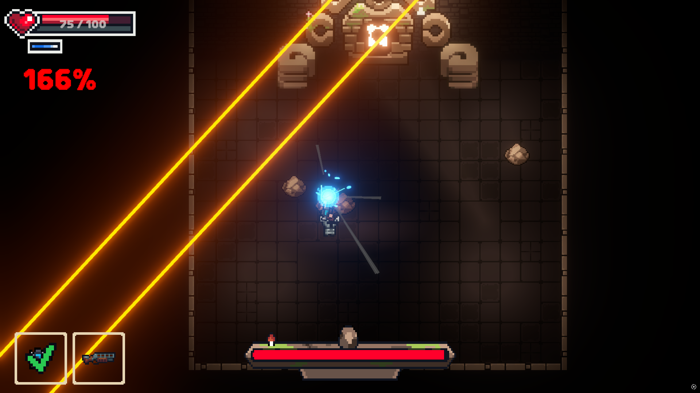
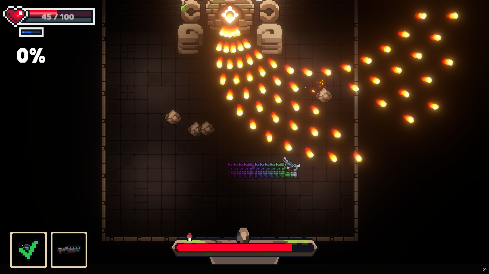
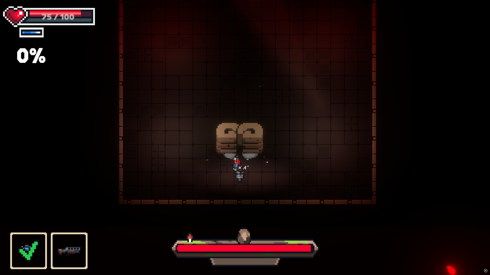

# Chasing Phasing

<aside>

> 📌 Enter the Gungeon에서 영감을 받은 보스 러시형 탄막 게임입니다. 차징을 활용해 보스를 처치하는 것이 목표입니다.

</aside>

  
  
  

🔗 [유튜브 영상](https://www.youtube.com/watch?v=pSK6y5vGnkk)  
🔗 [문서](https://abaft-yarn-52e.notion.site/Chasing-Phasing-1d5c32f25528802d9470c121a81b270c?pvs=74)  

| 항목 | 내용 |
| --- | --- |
| 🎮 게임 이름 | **Chasing Phasing** |
| 🕹 장르 | 탄막, 보스러시 |
| 🛠 사용 기술 | Unity, C# |
| 👤 역할 | 팀원 |
| 📅 개발 기간 | 2024.12.18 ~ 2025.12.21 |
| 👥 개발 인원 | 개발 3명, 아트 1명 |

## ✅ 수행한 역할

### 🔹 시스템 개발
- `Unity 6의 Behavior Tree` 시스템을 활용하여 골렘 보스 AI를 개발.

### 🔹 콘텐츠 개발
- 골렘 보스의 공격 패턴(레이저, 주먹, 총알 발사, 돌 떨어뜨리기 등)을 제작.
- 보스 애니메이션을 직접 제작.
- 이펙트를 통합적으로 관리.
- Fade In / Fade Out 및 씬 전환 시스템을 구현.

### 🔹 기타 시스템
- 싱글톤을 사용하지 않고 이벤트 기반 구조로 시스템을 설계.

## 🔹 주요 시스템 구성

### ✅ 보스 AI (BT 기반)
- Unity 6의 Behavior Tree를 사용하여 보스의 상태에 따라 패턴을 전환하도록 구성.
- 체력 조건에 따라 공격 패턴이 변경되는 트리 기반 로직 구현.

### ✅ 보스 패턴 시스템
- 골렘 보스가 다양한 방식으로 공격하도록 모듈화된 패턴 설계.
- 각 패턴은 독립적으로 동작하며 트리거 조건에 따라 유기적으로 연결됨.

### ✅ 씬 전환 시스템
- 페이드 인/아웃 효과를 활용해 자연스러운 화면 전환 구현.
- 씬 간 데이터 전달 없이 이벤트 중심으로 상태 관리.

### ✅ 이펙트 및 애니메이션 시스템
- 공격과 피격에 따라 다양한 이펙트를 적용하여 타격감 강화.
- 보스의 각 행동과 타이밍을 고려하여 커스텀 애니메이션 제작.