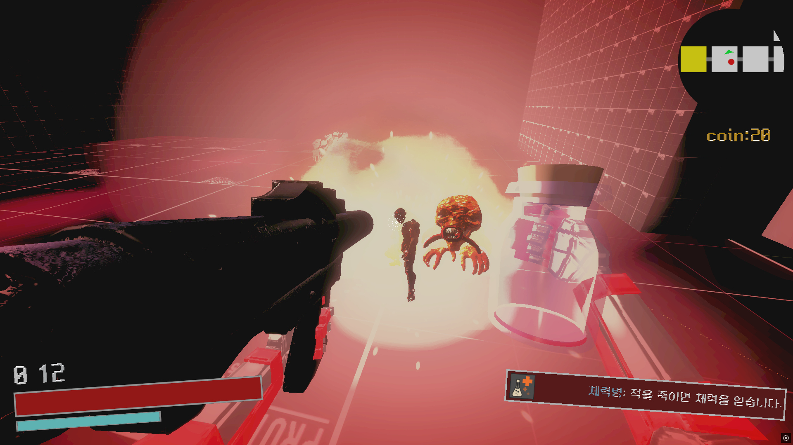

# GUAKE

<aside>

> 📌 BPM, QUAKE에서 영감을 받은 FPS 로그라이크 게임입니다. 다양한 병을 활용해 전략적으로 적을 처치하며 생존하는 것이 목표입니다.

</aside>

  
  
  

🔗 [유튜브 영상](https://youtu.be/x87P79N9RvQ)  
🔗 [문서](https://abaft-yarn-52e.notion.site/GUAKE-1d5c32f255288025902fe200684334e0)  

| 항목 | 내용 |
| --- | --- |
| 🎮 게임 이름 | **GUAKE** |
| 🕹 장르 | FPS, 로그라이크 |
| 🛠 사용 기술 | Unity, C# |
| 👤 역할 | 팀장 |
| 📅 개발 기간 | 2024.05.20 ~ 2024.06.21 |
| 👥 개발 인원 | 개발 2명 |

## ✅ 수행한 역할

### 🔹 시스템 개발
- `절차적 무한 맵 생성` 시스템 구현 → 절차적 생성 알고리즘에 대한 이해 향상.
- `FSM`을 활용하여 적 AI를 설계 및 개발.
- `ScriptableObject`를 이용한 총기 데이터 관리 시스템 구축.
- 전투 시스템 설계 및 구현 (총기 Caster, Health System 포함).
- 병 시스템 설계 및 능력 부여 로직 개발.
- UI 전반 구현 (체력, 병 효과, 상호작용 등).

### 🔹 콘텐츠 개발
- `6종`의 몬스터 및 각각의 공격 패턴 구현.
- `8종`의 총기 제작 및 총기별 Caster 커스터마이징.
- `5종`의 병(돈병, 공격력병, 큰 공격력병, 총알병, 체력병) 구현 및 효과 부여.
- 레벨 디자인: 몬스터 배치, 장애물 설계, 이동 경로 구성.
- 타이틀, 게임 오버 화면, 상점 상호작용, 총기 교체 기능 개발.

### 🔹 기타 시스템
- 팀장으로서 프로젝트 일정 관리 및 전체 기획 총괄.
- 전체 게임 시스템 구조 기획 및 기능별 구현 방식 설계.

---

## ✅ 주요 시스템 구성

### ✅ 절차적 맵 생성
- 방/길 구조를 무작위로 연결하여 매번 새로운 플레이 경험 제공.

### ✅ 전투 및 총기 시스템
- 총마다 다른 탄 퍼짐, 쿨타임, 캐스팅 방식 등을 가진 `Caster` 시스템 설계.
- 적과 플레이어의 상태를 반영한 `Health System` 구현.

### ✅ FSM 기반 적 AI
- FSM을 기반으로 한 일반 몬스터 AI.
- 몬스터마다 전투/추적/공격 등의 상태별 행동 정의.

### ✅ 병 시스템
- 게임 내 획득 가능한 병 아이템에 따라 능력치 및 효과 적용.
- SO 및 태그 기반 능력 부여 로직 작성.

### ✅ UI 및 UX
- 플레이어 정보 HUD, 병 상태 표시, 피해 효과(Blood Screen).
- 상점과 상호작용 가능한 UI/UX 구성.

