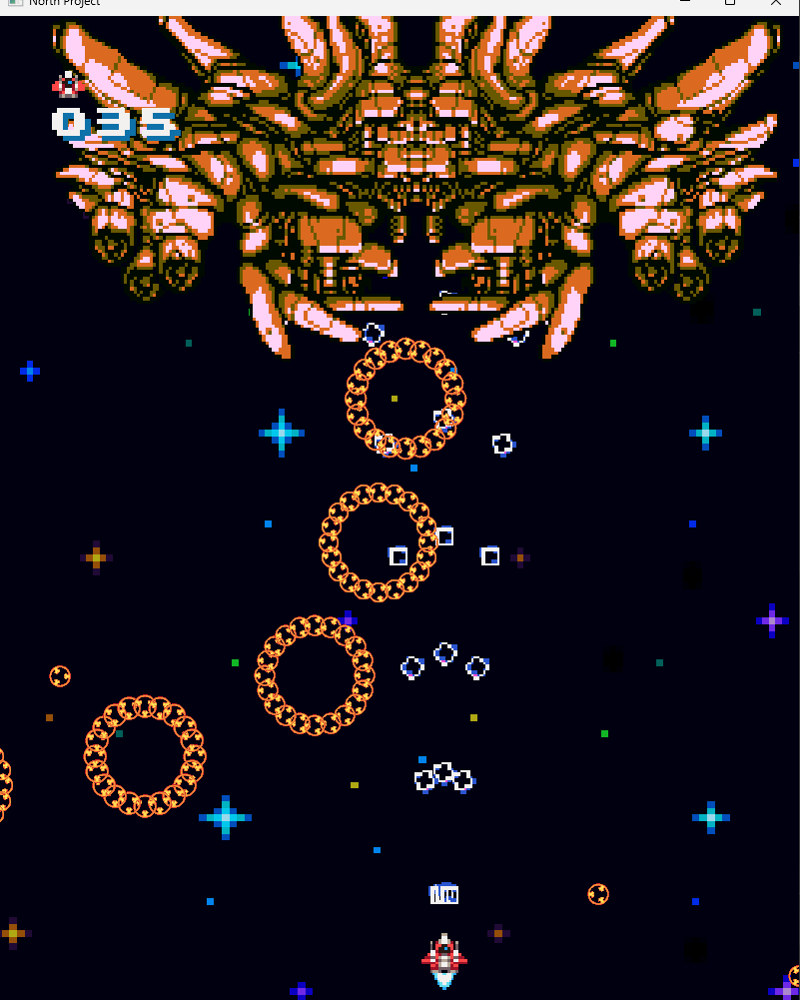
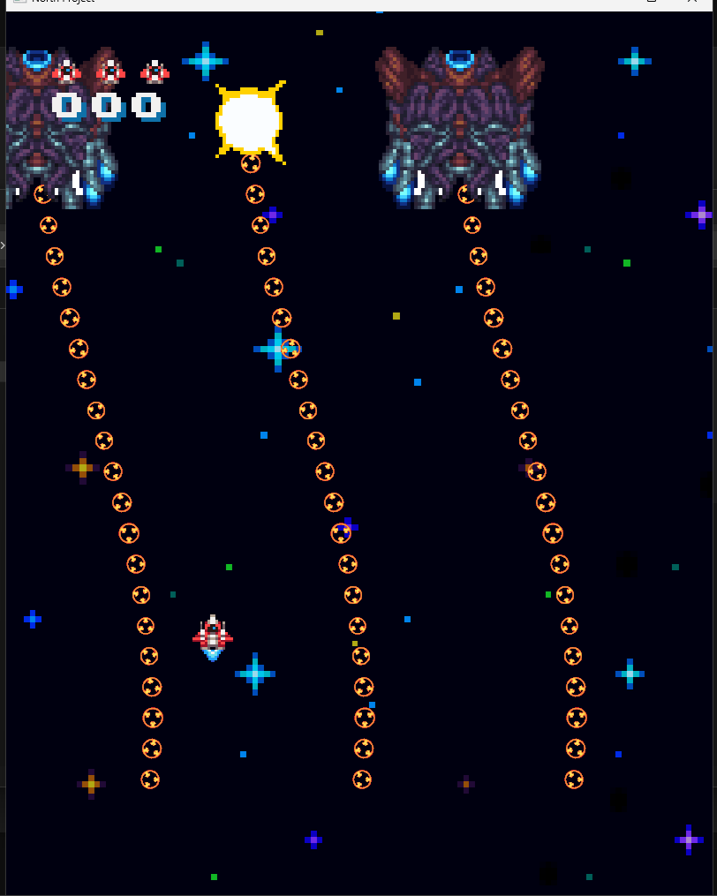
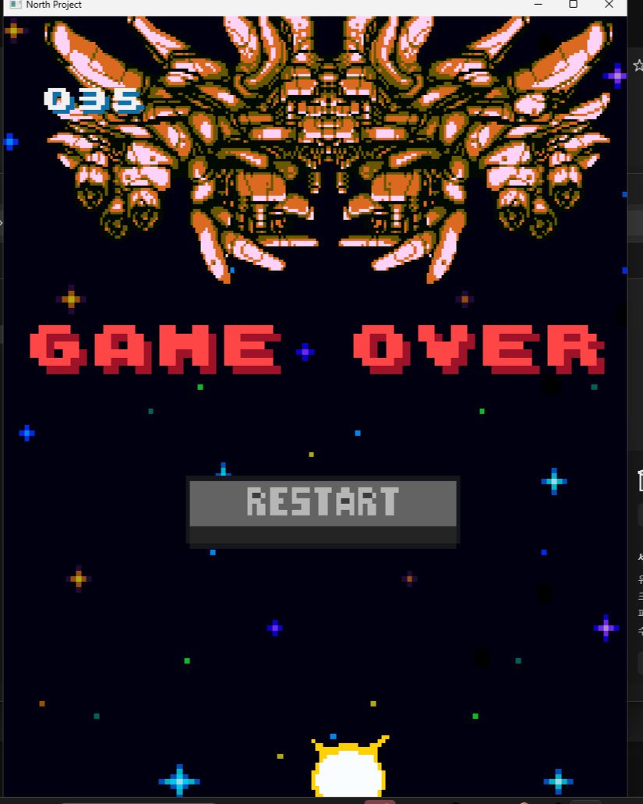

# North Project

<aside>

> 📌 동방 프로젝트에서 영감을 받은 슈팅 게임으로, 다양한 탄막 패턴을 피해 보스를 처치하는 것이 목표입니다.

</aside>

  
  
  

🔗 [유튜브](https://youtu.be/tJJwyJQIKWo)  
🔗 [문서](https://abaft-yarn-52e.notion.site/NortProject-1d5c32f25528804aab63d155d69cf811?pvs=74)  

| 항목 | 내용 |
| --- | --- |
| 🎮 게임 이름 | **North Project** |
| 🕹 장르 | 탄막, 슈팅 |
| 🛠 사용 기술 | WinAPI, C++ |
| 👤 역할 | 팀장 |
| 📅 개발 기간 | 2024.11.11 ~ 2024.12.06 |
| 👥 개발 인원 | 개발 2명, 기획 1명 |

## ✅ 수행한 역할

### 🔹 시스템 개발
- `BulletManager`를 개발하여 다양한 탄막 패턴을 손쉽게 조합하고 구현 가능하도록 설계.
- `UIManager`를 통해 UI 요소들을 중앙 집중식으로 관리.
- 공통 `UI` 클래스를 제작하여 모든 UI가 이를 상속받도록 하여 객체지향적으로 구조화.

### 🔹 콘텐츠 개발
- 용도에 맞는 다양한 버튼 및 UI 요소 직접 제작.
- 보스 및 적에 맞는 탄막 패턴 직접 설계 및 구현.
- 적 사망 시 이펙트 처리 및 플레이어 피격 시 흔들림 구현.
- 레벨업 아이템 제작 및 각 레벨별 효과 시스템 개발.
- 씬별 UI 배치 및 설정, 게임오버 및 재시작 기능 포함.

### 🔹 기타 시스템
- 무한 스크롤링 배경 구현.
- 전체 프로젝트 일정 관리 및 팀 기획 총괄.

---

### 🔹 주요 시스템 구성

#### ✅ 탄막 관리 시스템 (BulletManager)
- 탄막 오브젝트를 체계적으로 생성/관리할 수 있도록 설계하여 패턴 구현 편의성 향상

#### ✅ UI 관리 시스템 (UIManager)
- UI 요소들을 중앙 집중식으로 제어하며, Scene 간 전환 및 상태 동기화에 유리한 구조로 개발

#### ✅ UI 상속 구조
- 공통 UI 클래스를 기반으로 버튼, 인디케이터, 텍스트 등 다양한 요소를 객체지향적으로 구성

---

## ✅ 프로젝트를 통해 발전한 점

- `BulletManager`를 직접 설계하며 유지보수성과 확장성을 고려한 코드 작성법을 체득
- `UIManager`와 상속 기반 UI 구조를 통해 **객체지향적 설계와 중앙 집중형 처리**에 대한 실전 감각을 익힘
- WinAPI 기반 개발에서 **포인터와 메모리 관리**의 중요성과 실제 적용 방법을 배움
