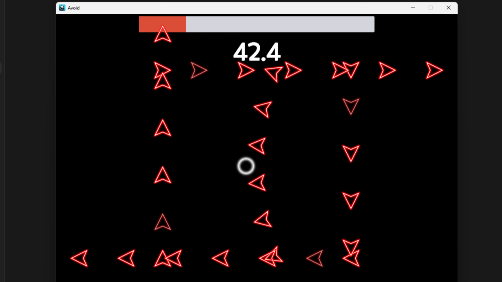
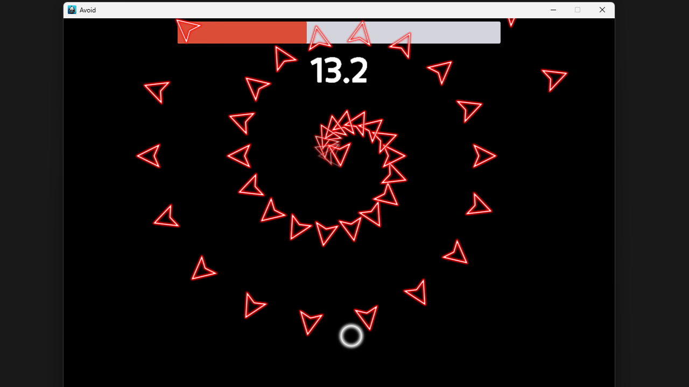
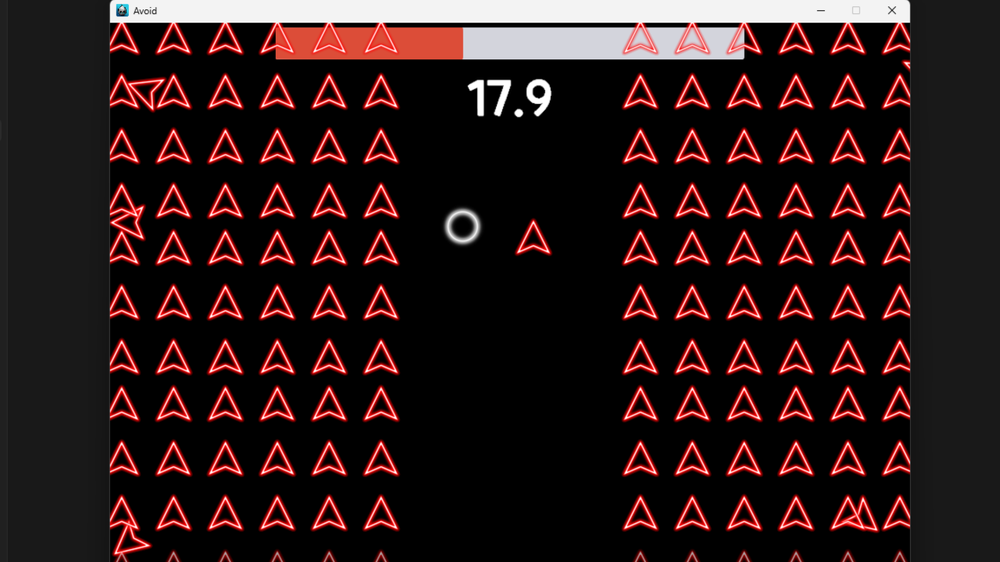

# 개인 코드 아카이브 📁

이 리포지토리는 여러 프로젝트에서 사용하거나 직접 작성한 소스 코드들을 모아둔 개인 코드 아카이브입니다.  
주로 **Cocos2dx/C++**, **Unity/C#** 등으로 작성되었습니다.  

## Avoid - [유튜브 영상](https://youtu.be/789LNSwjU-s)

  
  
  

**도구:** Cocos2d-x / C++  
**개발 기간:** 2025.04.19 ~ 2025.05.01  
**프로젝트 유형:** 개인 프로젝트  
**문서:** https://url.kr/8uiorr  

### 담당 업무
- ArrowPool을 활용하여 오브젝트를 효율적으로 관리  
- C++의 함수 객체(`functional`) 및 템플릿을 활용한 Delegate 시스템 직접 설계 및 구현  
- MVC 패턴을 적용하여 UI를 모듈화하고 확장성 향상  
- ArrowPattern을 추상 클래스로 구성하고, Pattern Queue를 도입해 다양한 패턴을 유연하게 조합 가능하도록 구현  
- Android Studio를 활용해 APK 파일 빌드  
